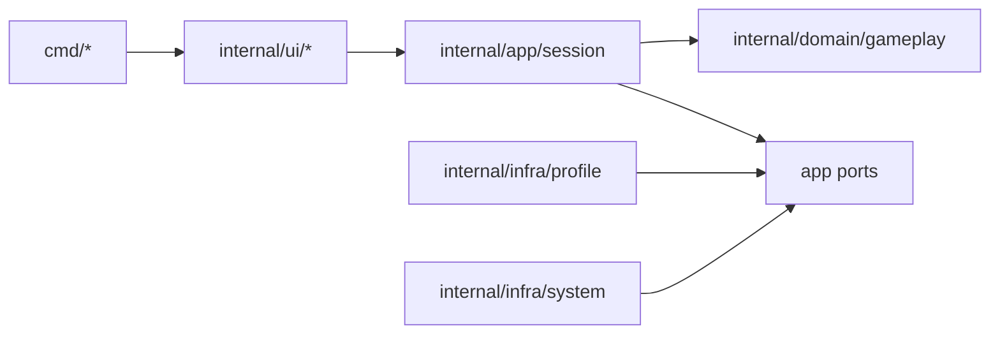

# Internal Documentation

This folder contains internal plans and technical documentation for the Snake project.

## Current Status

- DDD/SOLID transition completed on March 1, 2026.
- `docs/architecture/target-architecture.md` is the canonical architecture reference.
- Transition planning docs are retained as implementation history.

## Application Design Diagram

## Contents

- `docs/architecture/ddd-solid-redesign-plan.md`
  - Historical transition strategy used for the redesign.
- `docs/architecture/target-architecture.md`
  - Current package layout, boundaries, and dependency rules.
- `docs/architecture/migration-backlog.md`
  - Historical migration backlog and completion status.
- `docs/adr/0001-ddd-boundaries.md`
  - Architectural decision record for bounded contexts and layers.
- `docs/workflows/create-pr.md`
  - Team memory for creating pull requests via browser or GitHub CLI.

## Usage

- Update `target-architecture.md` and ADRs before major boundary changes.
- Keep transition docs as immutable history unless correcting factual errors.
- Keep code changes linked to ADR decisions.
